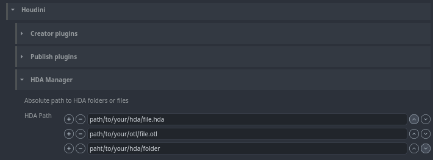

## HDA Manager
You can add your HDAs into Houdini by setting HDA files or folders path in **Houdini -> HDA Manager**. Accepts .hda and .otl format.

:::note Work in progress
This is still work in progress. Menu definition will be handled more friendly with widgets and not
raw json.
:::
