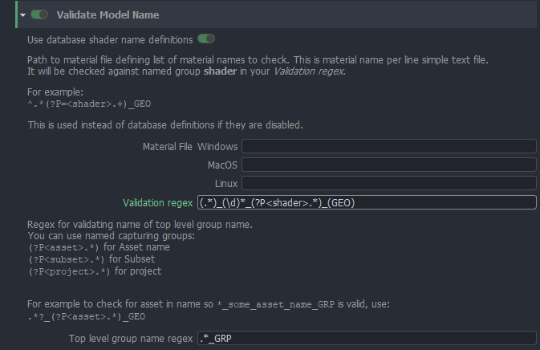
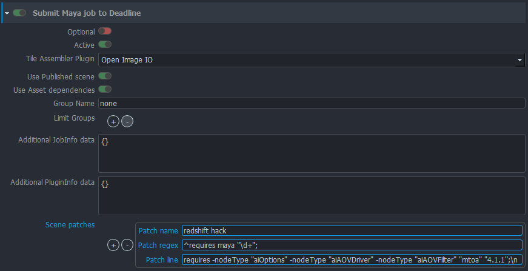
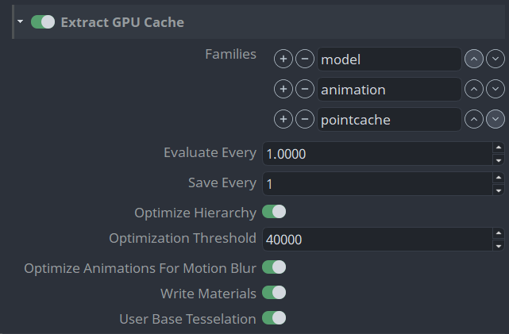
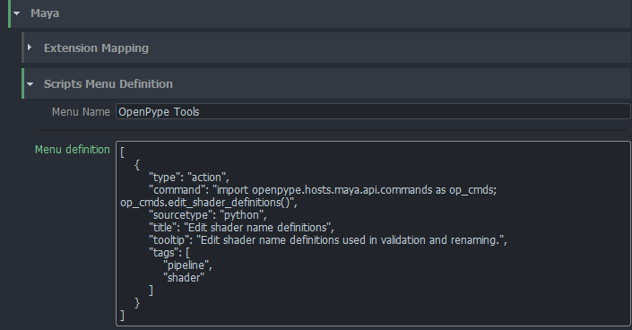
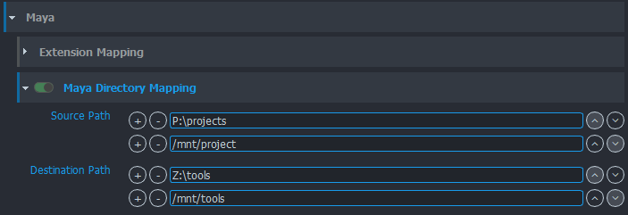
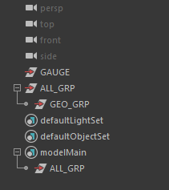
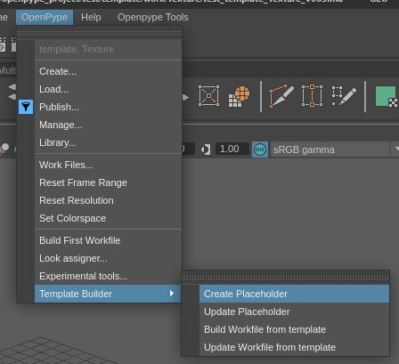
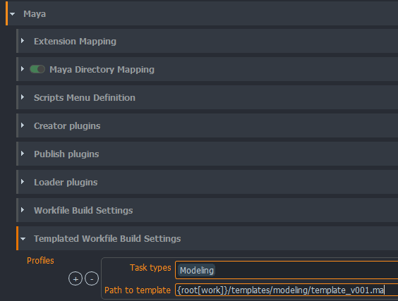
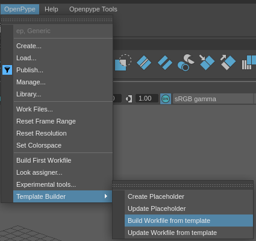

## Publish Plugins

### Render Settings Validator

`ValidateRenderSettings`

Render Settings Validator is here to make sure artists will submit renders
with the correct settings. Some of these settings are needed by OpenPype but some
can be defined by the admin using [OpenPype Settings UI](admin_settings.md).

OpenPype enforced settings include:

- animation must be enabled in output
- render prefix must start with `maya/<scene>` to make sure renders are in
correct directory
- there must be `<renderlayer>` or its equivalent in different renderers in
file prefix
- if multiple cameras are to be rendered, `<camera>` token must be in file prefix

For **Vray**:
- AOV separator must be set to `_` (underscore)

For **Redshift**:
- all AOVs must follow `<BeautyPath>/<BeautyFile>_<RenderPass>` image file prefix
- AOV image format must be same as the one set in Output settings

For **Renderman**:
- both image and directory prefixes must comply to `<layer>_<aov>.<f4>.<ext>` and `<ws>/renders/maya/<scene>/<layer>` respectively

For **Arnold**:
- there shouldn't be `<renderpass>` token when merge AOVs option is turned on

Additional check can be added via Settings - **Project Settings > Maya > Publish plugin > ValidateRenderSettings**.
You can add as many options as you want for every supported renderer. In first field put node type and attribute
and in the second required value. You can create multiple values for an attribute, but when repairing it'll be the first value in the list that get selected.


In this example we've put `aiOptions.AA_samples` in first one and `6` to second to enforce
Arnolds Camera (AA) samples to 6.

Note that `aiOptions` is not the name of node but rather its type. For renderers there is usually
just one instance of this node type but if that is not so, validator will go through all its
instances and check the value there. Node type for **VRay** settings is `VRaySettingsNode`, for **Renderman**
it is `rmanGlobals`, for **Redshift** it is `RedshiftOptions`.

### Model Name Validator

`ValidateRenderSettings`

This validator can enforce specific names for model members. It will check them against **Validation Regex**.
There is special group in that regex - **shader**. If present, it will take that part of the name as shader name
and it will compare it with list of shaders defined either in file name specified in **Material File** or from
database file that is per project and can be directly edited from Maya's *OpenPype Tools > Edit Shader name definitions* when
**Use database shader name definitions** is on. This list defines simply as one shader name per line.



For example - you are using default regex `(.*)_(\d)*_(?P<shader>.*)_(GEO)` and you have two shaders defined
in either file or database `foo` and `bar`.

Object named `SomeCube_0001_foo_GEO` will pass but `SomeCube_GEO` will not and `SomeCube_001_xxx_GEO` will not too.

#### Top level group name
There is a validation for top level group name too. You can specify whatever regex you'd like to use. Default will
pass everything with `_GRP` suffix. You can use *named capturing groups* to validate against specific data. If you
put `(?P<asset>.*)` it will try to match everything captured in that group against current asset name. Likewise you can
use it for **subset** and **project** - `(?P<subset>.*)` and `(?P<project>.*)`.

**Example**

You are working on asset (shot) `0030_OGC_0190`. You have this regex in **Top level group name**:
```regexp
.*?_(?P<asset>.*)_GRP
```

When you publish your model with top group named like `foo_GRP` it will fail. But with `foo_0030_OGC_0190_GRP` it will pass.

:::info About regex
All regexes used here are in Python variant.
:::

### Maya > Deadline submitter
This plugin provides connection between Maya and Deadline. It is using [Deadline Webservice](https://docs.thinkboxsoftware.com/products/deadline/10.0/1_User%20Manual/manual/web-service.html) to submit jobs to farm.


You can set various aspects of scene submission to farm with per-project settings in **Setting UI**.

 - **Optional** will mark sumission plugin optional
 - **Active** will enable/disable plugin
 - **Tile Assembler Plugin** will set what should be used to assemble tiles on Deadline. Either **Open Image IO** will be used
or Deadlines **Draft Tile Assembler**.
 - **Use Published scene** enable to render from published scene instead of scene in work area. Rendering from published files is much safer.
 - **Use Asset dependencies** will mark job pending on farm until asset dependencies are fulfilled - for example Deadline will wait for scene file to be synced to cloud, etc.
 - **Group name** use specific Deadline group for the job.
 - **Limit Groups** use these Deadline Limit groups for the job.
 - **Additional `JobInfo` data** JSON of additional Deadline options that will be embedded in `JobInfo` part of the submission data.
 - **Additional `PluginInfo` data** JSON of additional Deadline options that will be embedded in `PluginInfo` part of the submission data.
 - **Scene patches** - configure mechanism to add additional lines to published Maya Ascii scene files before they are used for rendering.
This is useful to fix some specific renderer glitches and advanced hacking of Maya Scene files. `Patch name` is label for patch for easier orientation.
`Patch regex` is regex used to find line in file, after `Patch line` string is inserted. Note that you need to add line ending.

## Load Plugins

### Reference Loader

#### Namespace and Group Name
Here you can create your own custom naming for the reference loader.

The custom naming is split into two parts: namespace and group name. If you don't set the namespace or the group name, an error will occur.
Here's the different variables you can use:

<div class="row markdown">
<div class="col col--5 markdown">

| Token | Description |
|---|---|
|`{asset_name}` | Asset name |
|`{asset_type}` | Asset type |
|`{subset}` | Subset name |
|`{family}` | Subset family |

</div>
</div>

The namespace field can contain a single group of '#' number tokens to indicate where the namespace's unique index should go. The amount of tokens defines the zero padding of the number, e.g ### turns into 001.

Warning: Note that a namespace will always be prefixed with a _ if it starts with a digit.

Example:


### Extract GPU Cache



- **Step** Specifies how often samples are taken during file creation. By default, one sample of your object's transformations is taken every frame and saved to the Alembic file.

  For example, a value of 2 caches the transformations of the current object at every other frame of the Cache Time Range.

- **Step Save** Specifies which samples are saved during cache creation. For example, a value of 2 specifies that only every other sample specified by the Step # frame(s) option is saved to your Alembic file.

- **Optimize Hierarchy** When on, nodes and objects in a selected hierarchy are consolidated to maximize the performance of the cache file during playback.
- **Optimization Threshold** (Available only when Optimize Hierarchy is on.) Specifies the maximum number of vertices contained in a single draw primitive. The default value of 40000 may be ideal for most Maya supported graphics cards. When set to the default value, after optimization, each object in the GPU cache file(s) will have no more than 40000 vertices. This value can be set higher depending on the memory available on your system graphics card.

- **Optimize Animations for Motion Blur** When on, objects with animated transform nodes display with motion blur when the cache is played back in Viewport 2.0 render mode. See Viewport 2.0 options.

  Maya first determines if the GPU cache includes animation data. If the GPU cache is static and does not contain animation data, Maya does not optimize the GPU cache for motion blur.

:::note Motion Blur does not support Cached Playback.
:::

- **Write Materials** When on, Maya exports the Lambert and Phong materials from source geometry to the GPU Cache file. These materials display when the GPU-cached file is played back in Viewport 2.0.

  GPU-cached objects support all the high-quality lighting and shading effects provide by the Viewport 2.0 rendering mode. See Viewport 2.0 options.

:::note Lambert and Phong materials do not display on GPU-cached files when they are played back in scene view's High Quality Rendering or Default Quality Rendering modes.
:::

- **Use Base Tessellation** Exports geometry with base tessellation and no smoothing applied. If this setting is turned off, the extractor will export geometry with the current Smooth Mesh Preview setting applied.

### Extract Playblast Settings (review)
These settings provide granular control over how the playblasts or reviews are produced in Maya.

Some of these settings are also available on the instance itself, in which case these settings will become the default value when creating the review instance.


- **Compression type** which file encoding to use.
- **Data format** what format is the file encoding.
- **Quality** lets you control the compression value for the output. Results can vary depending on the compression you selected. Quality values can range from 0 to 100, with a default value of 95.
- **Background Color** the viewports background color.
- **Background Bottom** the viewports background bottom color.
- **Background Top** the viewports background top color.
- **Override display options** override the viewports display options to use what is set in the settings.
- **Isolate view** isolates the view to what is in the review instance. If only a camera is present in the review instance, all nodes are displayed in view.
- **Off Screen** records the playblast hidden from the user.
- **2D Pan/Zoom** enables the 2D Pan/Zoom functionality of the camera.
- **Renderer name** which renderer to use for playblasting.
- **Width** width of the output resolution. If this value is `0`, the asset's width is used.
- **Height** height of the output resolution. If this value is `0`, the asset's height is used.

#### Viewport Options

Most settings to override in the viewport are self explanatory and can be found in Maya.


- **Override Viewport Options** enable to use the settings below for the viewport when publishing the review.

#### Camera Options

These options are set on the camera shape when publishing the review. They correspond to attributes on the Maya camera shape node.


## Include/exclude handles by task type
You can include or exclude handles, globally or by task type.

The "Include handles by default" defines whether by default handles are included. Additionally you can add a per task type override whether you want to include or exclude handles.

For example, in this image you can see that handles are included by default in all task types, except for the 'Lighting' task, where the toggle is disabled.


And here you can see that the handles are disabled by default, except in 'Animation' task where it's enabled.


## Custom Menu
You can add your custom tools menu into Maya by extending definitions in **Maya -> Scripts Menu Definition**.


:::note Work in progress
This is still work in progress. Menu definition will be handled more friendly with widgets and not
raw json.
:::

## Multiplatform path mapping
You can configure path mapping using Maya `dirmap` command. This will add bi-directional mapping between
list of paths specified in **Settings**. You can find it in **Settings -> Project Settings -> Maya -> Maya Directory Mapping**


## Templated Build Workfile

Building a workfile using a template designed by users. Helping to assert homogeneous subsets hierarchy and imports. Template stored as file easy to define, change and customize for production needs.

 **1. Make a template**

Make your template. Add families and everything needed for your tasks. Here is an example template for the modeling task using a placeholder to import a gauge.



If needed, you can add placeholders when the template needs to load some assets. **OpenPype > Template Builder > Create Placeholder**



- **Configure placeholders**

Fill in the necessary fields (the optional fields are regex filters)


  - ***Builder type***: Whether the the placeholder should load current asset representations or linked assets representations

  - ***Representation***: Representation that will be loaded (ex: ma, abc, png, etc...)

  - ***Family***: Family of the representation to load (main, look, image, etc ...)

  - ***Loader***: Placeholder loader name that will be used to load corresponding representations

  - ***Order***: Priority for current placeholder loader (priority is lowest first, highest last)

  - ***Loader arguments***: Loader arguments dictionary can be used to pass optional data to loaders.
  One use case is to define a custom Subset name for the animation instances created while loading Rig references.This follows the custom namespace system used by loaders.

    **Example**
      ```
      {"animationSubsetName": "{asset_name}_animation_{subset}_##_"}
      ```


- **Save your template**


 **2. Configure Template**

- **Go to Studio settings > Project > Your DCC > Templated Build Settings**
- Add a profile for your task and enter path to your template



**3. Build your workfile**

- Open maya

- Build your workfile



## Explicit Plugins Loading
You can define which plugins to load on launch of Maya here; `project_settings/maya/explicit_plugins_loading`. This can help improve Maya's launch speed, if you know which plugins are needed.

By default only the required plugins are enabled. You can also add any plugin to the list to enable on launch.

:::note technical
When enabling this feature, the workfile will be launched post initialization no matter the setting on `project_settings/maya/open_workfile_post_initialization`. This is to avoid any issues with references needing plugins.

Renderfarm integration is not supported for this feature.
:::
