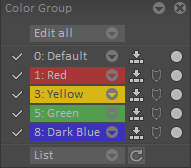
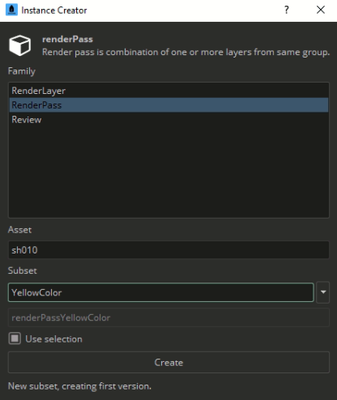
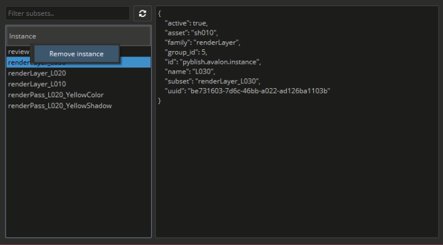

-   [Work Files](artist_tools.md#workfiles)
-   [Load](artist_tools.md#loader)
-   [Create](artist_tools.md#creator)
-   [Subset Manager](artist_tools.md#subset-manager)
-   [Scene Inventory](artist_tools.md#scene-inventory)
-   [Publish](artist_tools.md#publisher)
-   [Library](artist_tools.md#library)

## Setup
When you launch TVPaint with OpenPype for the very first time it is necessary to do some additional steps. Right after the TVPaint launching a few system windows will pop up. 

Choose `Replace the file in the destination`. Then another window shows up. 

Click on `Continue`.

After opening TVPaint go to the menu bar: `Windows → Plugins → OpenPype`. 

Another TVPaint window pop up. Please press `Yes`. This window will be presented in every single TVPaint launching. Unfortunately, there is no other way how to workaround it. 

Now OpenPype Tools menu is in your TVPaint work area. 

You can start your work. 

---

## Usage
In TVPaint you can find the Tools in OpenPype menu extension. The OpenPype Tools menu should be available in your work area. However, sometimes it happens that the Tools menu is hidden. You can display the extension panel by going to `Windows -> Plugins -> OpenPype`.

## Create 
In TVPaint you can create and publish **[Reviews](#review)**, **[Workfile](#workfile)**, **[Render Passes](#render-pass)** and **[Render Layers](#render-layer)**.

You have the possibility to organize your layers by using `Color group`.  

On the bottom left corner of your timeline, you will note a `Color group` button.

It allows you to choose a group by checking one of the colors of the color list. 

The timeline's animation layer can be marked by the color you pick from your Color group. Layers in the timeline with the same color are gathered into a group represents one render layer. 

:::important
OpenPype specifically never tries to guess what you want to publish from the scene. Therefore, you have to tell OpenPype what you want to publish. There are three ways how to publish render from the scene. 
:::

When you want to publish `review` or `render layer` or `render pass`, open the `Creator` through the Tools menu `Create` button.

### Review
`Review` renders the whole file as is and sends the resulting QuickTime to Ftrack.
- Is automatically created during publishing.

### Workfile
`Workfile` stores the source workfile as is during publishing (e.g. for backup).
- Is automatically created during publishing.

### Render Layer

Render Layer bakes all the animation layers of one particular color group together. 

- Choose any amount of animation layers that need to be rendered together and assign them a color group. 
- Select any layer of a particular color
- Go to `Creator` and choose `RenderLayer`. 
- In the `Subset`, type in the name that the final published RenderLayer should have according to the naming convention in your studio. *(L10, BG, Hero, etc.)* 
- Press `Create`
- When you run [publish](#publish), the whole color group will be rendered together and published as a single `RenderLayer`

### Render Pass

Render Passes are smaller individual elements of a Render Layer. A `character` render layer might
consist of multiple render passes such as `Line`, `Color` and `Shadow`.

Render Passes are specific because they have to belong to a particular layer. If you try to create a render pass and did not create any render layers before, an error message will pop up. 

When you want to create `RenderPass`
- choose one or several animation layers within one color group that you want to publish
- In the Creator, pick `RenderPass`
- Fill the `Subset` with the name of your pass, e.g. `Color`. 
- Press `Create`

  

In this example, OpenPype will render selected animation layers within the given color group. E.i. the layers *L020_colour_fx*, *L020_colour_mouth*, and *L020_colour_eye* will be rendered as one pass belonging to the yellow RenderLayer.  

:::note
You can check your RendrePasses and RenderLayers in [Subset Manager](#subset-manager) or you can start publishing. The publisher will show you a collection of all instances on the left side.
:::

---

## Publish 

Now that you have created the required instances, you can publish them via `Publish` tool. 
- Click on `Publish` in OpenPype Tools menu.
- wait until all instances are collected. 
- You can check on the left side whether all your instances have been created and are ready for publishing. 
- Fill the comment on the bottom of the window.
- Press the `Play` button to publish

Once the `Publisher` turns gets green your renders have been published. 

---

## Subset Manager
All created instances (render layers, passes, and reviews) will be shown as a simple list. If you don't want to publish some, right click on the item in the list and select `Remove instance`.

---

## Load 
When you want to load existing published work you can reach the `Loader` through the OpenPype Tools `Load` button.

The supported families for TVPaint are:

- `render`
- `image`
- `background`
- `plate`

To load a family item, right-click on the subset you want and import their representations, switch among the versions, delete older versions, copy files, etc.

---

## Scene Inventory
Scene Inventory shows you everything that you have loaded into your scene using OpenPype. You can reach it through the extension's `Scene Inventory` button.

You can switch to a previous version of the file or update it to the latest or delete items. 
